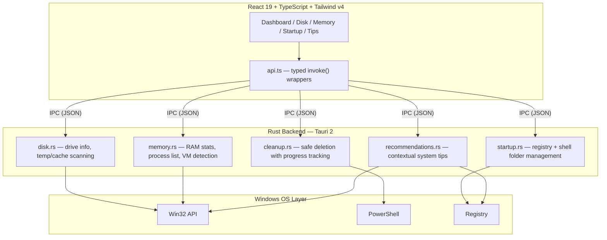

<div align="center">


<br>

# System Health Tool

Scan, diagnose, and clean up Windows system issues<br>from a single native desktop app.

<br>

[](LICENSE)
&nbsp;
[](https://github.com/TMHSDigital/system-cleaner/releases)
&nbsp;
[](https://v2.tauri.app)
&nbsp;
[](https://react.dev)
&nbsp;
[](https://www.rust-lang.org)

<br>

`~2.5 MB installer` &middot; `No bloat` &middot; `No telemetry` &middot; `Open source`

<br>

[Download](https://github.com/TMHSDigital/system-cleaner/releases) &nbsp;&nbsp;|&nbsp;&nbsp; [Architecture](#system-architecture) &nbsp;&nbsp;|&nbsp;&nbsp; [Build from source](#build-from-source) &nbsp;&nbsp;|&nbsp;&nbsp; [Contributing](docs/CONTRIBUTING.md)

</div>

<br>

---

<br>

### What it does

| Module | Capabilities |
|:-------|:-------------|
| **Dashboard** | Compute a real-time health score (0-100). Visualize drive capacity, RAM usage, and surface a one-click **Quick Clean** that only touches safe items. |
| **Disk Cleanup** | Scan temp files, browser caches, crash dumps, dev caches, and the recycle bin. Tag every item with a color-coded risk level before deletion. |
| **Memory** | Monitor live RAM pressure. Detect runaway processes, Hyper-V VMs, and WSL instances. Kill non-system processes directly from the panel. |
| **Startup** | Toggle startup entries on/off via registry and shell folders. Display impact ratings (High / Medium / Low) and recommended-to-disable flags. |
| **Recommendations** | Generate contextual tips (e.g. *"Pagefile is on a full drive"*) and expose a **Fix It** action that navigates to the responsible panel. |

<br>

### Safety model

> [!IMPORTANT]
> No files are deleted without explicit user confirmation. Every cleanable item is displayed with its full path and risk classification before any action is taken.

| Risk | Policy |
|:-----|:-------|
| **Safe** | Temp files, caches, crash dumps. Regenerated automatically. Quick Clean only touches this tier. |
| **Moderate** | Dev caches (npm, pip, cargo), Windows Update files. Re-downloaded on demand. Requires manual selection. |
| **Advanced** | Reserved for future surface area. Will require explicit opt-in confirmation. |

> [!CAUTION]
> Locked files are silently skipped. System-critical processes are protected and cannot be killed from the Memory panel.

Full policy documented in [`docs/SAFETY.md`](docs/SAFETY.md).

<br>

---

<br>

### Install

Grab the latest build from [**Releases**](https://github.com/TMHSDigital/system-cleaner/releases):

| Artifact | Size |
|:---------|:-----|
| `System Cleaner_x.x.x_x64-setup.exe` (NSIS) | ~2.5 MB |
| `System Cleaner_x.x.x_x64_en-US.msi` | ~3.8 MB |

> [!NOTE]
> Admin elevation is requested on launch. Required for accessing system temp directories, enumerating all processes, and managing startup registry keys.

<br>

### Build from source

`Node.js >= 18` &middot; `Rust >= 1.85` &middot; `Windows 10/11` &middot; `WebView2 Runtime`

```bash
git clone https://github.com/TMHSDigital/system-cleaner.git
cd system-cleaner && npm install

npm run tauri:dev        # dev mode with hot reload
npm run tauri:build      # production build → src-tauri/target/release/bundle/
```

<br>

---

<br>

### System architecture



Full architecture docs: [`docs/ARCHITECTURE.md`](docs/ARCHITECTURE.md)

<br>

### Tech stack

| | |
|:--|:--|
| **Frontend** | React 19 &middot; TypeScript 5.9 &middot; Tailwind CSS v4 &middot; Recharts |
| **Backend** | Tauri 2 &middot; Rust &middot; sysinfo &middot; winreg &middot; windows-rs |
| **Build** | Vite 7 &middot; Cargo &middot; tauri-cli |
| **UI** | Lucide React &middot; Custom design tokens |

<br>

<details>
<summary><strong>Project structure</strong></summary>

<br>

```
src/
├── App.tsx                         # Sidebar nav + tab routing
├── index.css                       # Global styles + scrollbar
├── main.tsx                        # React DOM entry point
├── components/
│   ├── Dashboard.tsx               # Health score, drives, RAM, Quick Clean
│   ├── DiskCleanup.tsx             # Scan → Review → Clean workflow
│   ├── MemoryPanel.tsx             # RAM chart, processes, VM detection
│   ├── StartupManager.tsx          # Toggle switches + impact ratings
│   └── Recommendations.tsx         # Auto-tips with Fix It navigation
├── lib/
│   ├── api.ts                      # Typed Tauri invoke() wrappers
│   ├── types.ts                    # Shared TypeScript interfaces
│   └── format.ts                   # Byte/percent formatting utils
└── styles/
    └── tokens.css                  # Design tokens, component classes, animations

src-tauri/
├── src/
│   ├── lib.rs                      # Tauri bootstrap + command registration
│   ├── main.rs                     # Windows entry point (#![windows_subsystem])
│   └── commands/
│       ├── disk.rs                 # get_drive_info, scan_disk
│       ├── memory.rs               # get_memory_info, get_processes, kill_process, get_vm_info
│       ├── startup.rs              # get_startup_items, toggle_startup_item
│       ├── cleanup.rs              # clean_items
│       └── recommendations.rs      # get_recommendations
├── tauri.conf.json                 # Window config, bundle targets, CSP
├── Cargo.toml                      # Rust dependencies + crate config
└── icons/                          # Generated app icons (ico, icns, png)

docs/
├── ARCHITECTURE.md                 # Internal design + data flow
├── SAFETY.md                       # Risk model + deletion policy
└── CONTRIBUTING.md                 # Setup, code style, PR guidelines
```

</details>

<br>

---

<br>

### Contributing

PRs welcome. See [`docs/CONTRIBUTING.md`](docs/CONTRIBUTING.md) for environment setup, code style, and how to add new cleanup targets or recommendation rules.

<br>

<div align="center">

[MIT License](LICENSE) &middot; [TMHSDigital](https://github.com/TMHSDigital) &middot; [Security Policy](docs/SAFETY.md)

</div>
